# AI Podcast Generator - 重構架構設計

## 目錄
1. [現有專案分析摘要](#1-現有專案分析摘要)
2. [重構目標與需求](#2-重構目標與需求)
3. [新架構設計](#3-新架構設計)
4. [組件結構](#4-組件結構)
5. [API 整合詳情](#5-api-整合詳情)
6. [音頻生成方案](#6-音頻生成方案)
7. [實作路線圖](#7-實作路線圖)

---

## 1. 現有專案分析摘要

### 1.1 現有架構概覽

現有專案採用前後端分離架構：

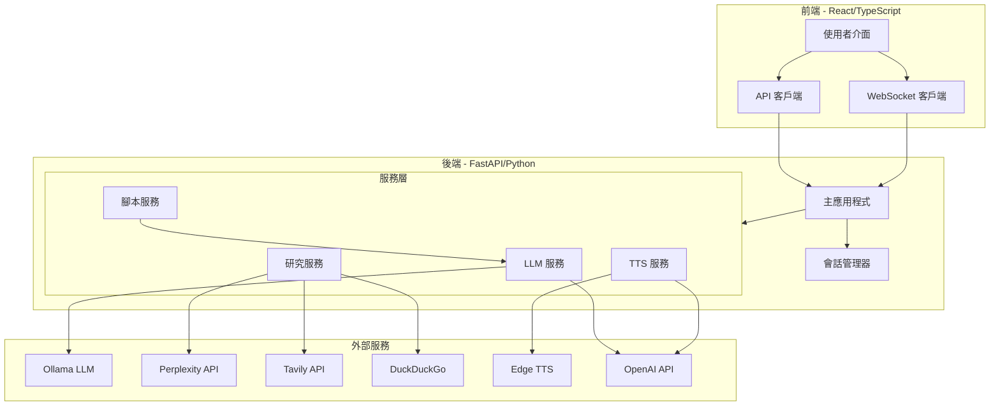

### 1.2 現有處理流程

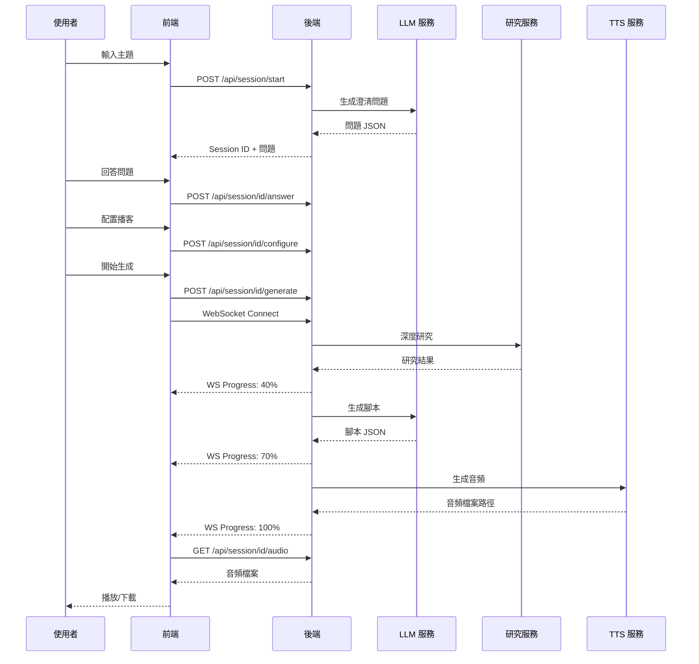

### 1.3 現有問題與限制

| 問題 | 說明 |
|------|------|
| **後端依賴** | 所有處理都在後端進行，需要維護伺服器 |
| **API Key 管理** | API Key 在後端環境變數中配置，使用者無法自行提供 |
| **部署複雜度** | 需要 Docker、Ollama、FFmpeg 等依賴 |
| **擴展性限制** | 後端資源成為瓶頸 |

---

## 2. 重構目標與需求

### 2.1 核心目標

1. **最大化瀏覽器端處理** - 最小化或消除後端處理需求 ✅ 已完成
2. **使用者提供 API Key** - 透過前端彈出面板管理 Perplexity 和 Gemini API Key ✅ 已完成
3. **Perplexity API** - 用於資料收集、研究、大綱創建和文字編輯 ✅ 已完成
4. **Google Gemini API** - 用於生成對話式播客（主持人帶領大綱提問，專家提供解釋） ✅ 已完成
5. **可下載播客** - 生成的播客音頻可下載 ✅ 已完成

### 2.2 技術需求

| 需求 | 解決方案 |
|------|----------|
| CORS 限制處理 | Perplexity 和 Gemini API 支援 CORS，可直接從瀏覽器調用 ✅ 已驗證 |
| API Key 儲存 | localStorage 安全儲存 ✅ 已實現 |
| 音頻生成 | Web Speech API 或雲端 TTS API ✅ 已實現 |
| 狀態管理 | React Context + useReducer ✅ 已實現 |
| 無後端部署 | 靜態網站託管（Vercel、Netlify 等） ✅ 已實現 |

---

## 3. 新架構設計

### 3.1 系統架構圖

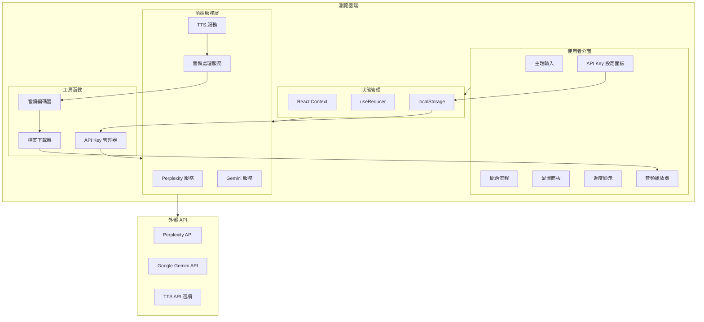

### 3.2 資料流設計

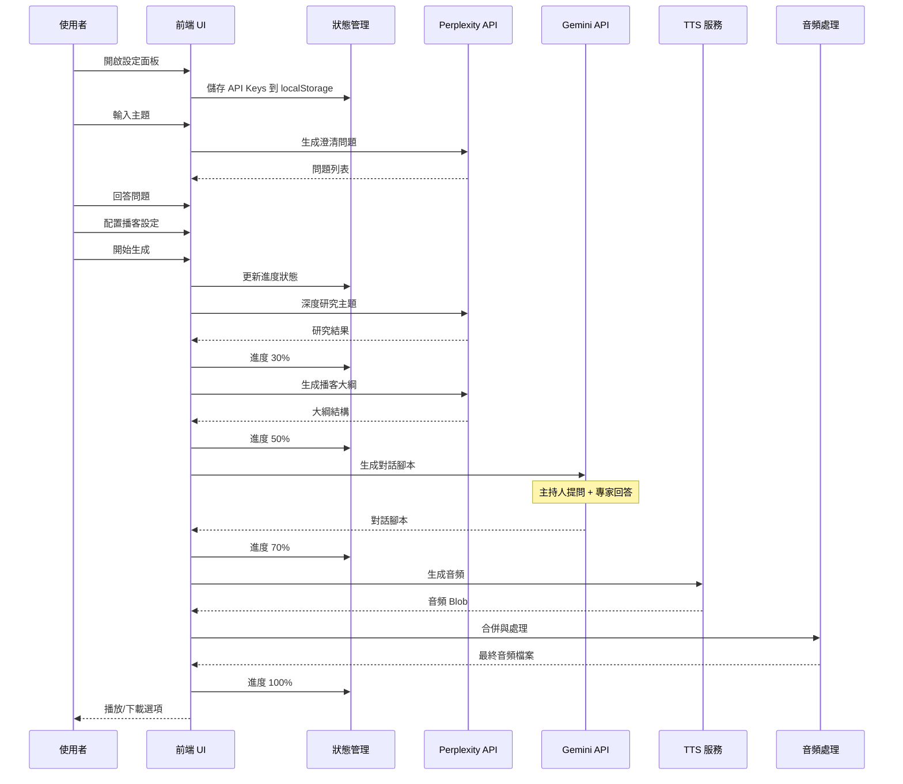

### 3.3 無後端架構優勢

| 優勢 | 說明 |
|------|------|
| **零伺服器成本** | 可部署在免費的靜態託管平台 |
| **即時部署** | 無需等待伺服器配置 |
| **使用者隱私** | API Key 不經過任何伺服器 |
| **無限擴展** | 每個使用者的瀏覽器獨立處理 |
| **開發簡化** | 無需維護後端服務 |

---

## 4. 組件結構

### 4.1 組件樹狀圖

```
App
├── Header
│   └── ApiKeyPanel (彈出面板)
│       ├── PerplexityKeyInput
│       └── GeminiKeyInput
│
├── MainContent
│   ├── ResearchPanel
│   │   └── QuestionFlow
│   ├── OutlinePanel
│   ├── ScriptPanel
│   └── AudioPanel
│       ├── AudioPreview
│       └── DownloadButton
│
└── ErrorBoundary
    └── ErrorDisplay
```

### 4.2 核心組件說明

#### 4.2.1 ApiKeyPanel - API Key 管理彈出面板 ✅ 已實現

```typescript
interface ApiKeyPanelProps {
  isOpen: boolean;
  onClose: () => void;
}

interface ApiKeys {
  perplexityApiKey: string;
  geminiApiKey: string;
}

// 功能：
// - 顯示當前 API Key 狀態（已設定/未設定）
// - 輸入欄位帶有顯示/隱藏切換
// - 驗證 API Key 格式
// - 儲存到 localStorage
// - 測試連接按鈕
```

#### 4.2.2 PerplexityService - Perplexity 服務 ✅ 已實現

```typescript
class PerplexityService {
  private apiKey: string;
  private baseUrl: string = 'https://api.perplexity.ai';

  // 生成澄清問題
  async generateQuestions(topic: string): Promise<Question[]>;

  // 深度研究
  async deepResearch(topic: string, context: QaContext): Promise<ResearchResult>;

  // 生成播客大綱
  async generateOutline(research: ResearchResult): Promise<Outline>;

  // 編輯和優化文字
  async editText(content: string, instructions: string): Promise<string>;
}
```

#### 4.2.3 GeminiService - Gemini 服務 ✅ 已實現

```typescript
class GeminiService {
  private apiKey: string;
  private baseUrl: string = 'https://generativelanguage.googleapis.com/v1beta';

  // 生成對話腳本
  async generateDialogueScript(
    outline: Outline,
    research: ResearchResult,
    config: PodcastConfig
  ): Promise<DialogueScript>;

  // 生成主持人台詞
  async generateHostLine(context: DialogueContext): Promise<string>;

  // 生成expert回答
  async generateExpertResponse(
    question: string,
    research: ResearchResult
  ): Promise<string>;
}
```

### 4.3 狀態管理結構

```typescript
interface AppState {
  // 步驟狀態
  currentStep: 'input' | 'questions' | 'config' | 'generating' | 'complete';
  
  // 主題和問題
  topic: string;
  questions: Question[];
  answers: Record<string, string>;
  
  // 配置
  config: PodcastConfig;
  
  // 進度
  progress: ProgressState;
  
  // 結果
  research: ResearchResult | null;
  outline: Outline | null;
  script: DialogueScript | null;
  audioBlob: Blob | null;
  
  // API Keys
  apiKeys: ApiKeyState;
  
  // 錯誤處理
  error: Error | null;
}

interface ApiKeyState {
  perplexityKey: string | null;
  geminiKey: string | null;
  isValidated: {
    perplexity: boolean;
    gemini: boolean;
  };
}
```

---

## 5. API 整合詳情

### 5.1 Perplexity API 整合 ✅ 已實現

#### 5.1.1 API 端點

| 端點 | 用途 | 模型 |
|------|------|------|
| `POST /chat/completions` | 生成內容 | sonar, sonar-pro, sonar-deep-research |

#### 5.1.2 請求格式

```typescript
interface PerplexityRequest {
  model: 'sonar' | 'sonar-pro' | 'sonar-deep-research';
  messages: Array<{
    role: 'system' | 'user' | 'assistant';
    content: string;
  }>;
  temperature?: number;
  return_citations?: boolean;
  return_related_questions?: boolean;
}

interface PerplexityResponse {
  choices: Array<{
    message: {
      content: string;
      role: string;
    };
  }>;
  citations?: string[];
  related_questions?: string[];
}
```

#### 5.1.3 使用場景

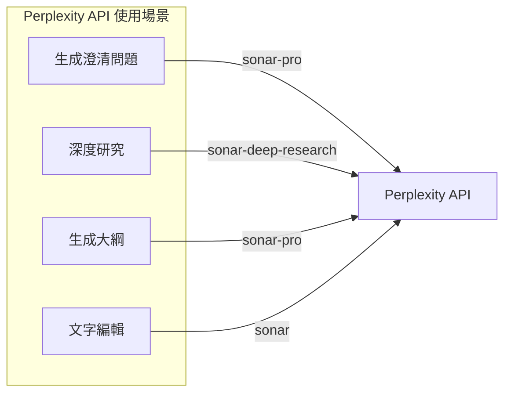

#### 5.1.4 CORS 驗證

Perplexity API 支援 CORS，可直接從瀏覽器調用：

```typescript
const response = await fetch('https://api.perplexity.ai/chat/completions', {
  method: 'POST',
  headers: {
    'Authorization': `Bearer ${apiKey}`,
    'Content-Type': 'application/json'
  },
  body: JSON.stringify(request)
});
```

### 5.2 Google Gemini API 整合 ✅ 已實現

#### 5.2.1 API 端點

| 端點 | 用途 |
|------|------|
| `POST /models/{model}:generateContent` | 生成內容 |
| `POST /models/{model}:streamGenerateContent` | 串流生成 |

#### 5.2.2 請求格式

```typescript
interface GeminiRequest {
  contents: Array<{
    parts: Array<{
      text: string;
    }>;
    role: 'user' | 'model';
  }>;
  systemInstruction?: {
    parts: Array<{ text: string }>;
  };
  generationConfig?: {
    temperature?: number;
    maxOutputTokens?: number;
  };
}

interface GeminiResponse {
  candidates: Array<{
    content: {
      parts: Array<{ text: string }>;
      role: string;
    };
  }>;
}
```

#### 5.2.3 對話生成策略

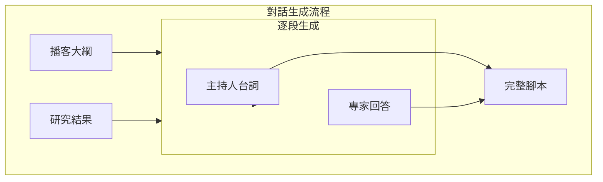

#### 5.2.4 CORS 驗證

Gemini API 支援 CORS，可直接從瀏覽器調用：

```typescript
const response = await fetch(
  `https://generativelanguage.googleapis.com/v1beta/models/gemini-1.5-flash:generateContent?key=${apiKey}`,
  {
    method: 'POST',
    headers: {
      'Content-Type': 'application/json'
    },
    body: JSON.stringify(request)
  }
);
```

### 5.3 API Key 安全性考量

| 考量 | 解決方案 |
|------|----------|
| localStorage 安全 | 僅儲存在使用者本地，不上傳任何伺服器 |
| 傳輸安全 | 使用 HTTPS 加密傳輸 |
| 金鑰洩露風險 | 使用者自行承擔風險，建議使用有限額度的 API Key |
| 清除功能 | 提供一鍵清除所有 API Key 功能 |

---

## 6. 音頻生成方案

### 6.1 方案比較

| 方案 | 優點 | 缺點 | 適用場景 |
|------|------|------|----------|
| **Web Speech API** | 免費、無需 API Key、純瀏覽器 | 音質較差、聲音選擇有限 | 快速原型、離線使用 |
| **Google Cloud TTS** | 高品質、多語言 | 需要 API Key、付費 | 專業級播客 |
| **OpenAI TTS** | 非常自然 | 需要 API Key、付費 | 高品質需求 |
| **ElevenLabs** | 最自然的聲音 | 付費、較貴 | 專業播客製作 |

### 6.2 推薦方案：混合模式 ✅ 已實現

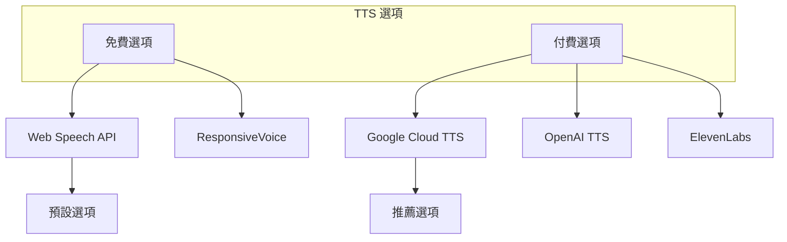

### 6.3 Web Speech API 實作 ✅ 已實現

```typescript
class WebSpeechTTSService {
  private synth: SpeechSynthesis;
  private voices: SpeechSynthesisVoice[];

  constructor() {
    this.synth = window.speechSynthesis;
    this.voices = [];
    this.loadVoices();
  }

  private loadVoices(): void {
    this.voices = this.synth.getVoices();
  }

  async generateAudio(text: string, voice: string): Promise<Blob> {
    return new Promise((resolve, reject) => {
      const utterance = new SpeechSynthesisUtterance(text);
      const selectedVoice = this.voices.find(v => v.name === voice);
      if (selectedVoice) {
        utterance.voice = selectedVoice;
      }

      // 使用 MediaRecorder 錄製音頻
      // 注意：Web Speech API 不直接支援錄製
      // 需要使用替代方案
    });
  }
}
```

### 6.4 替代方案：使用線上 TTS API ✅ 已實現

由於 Web Speech API 無法直接匯出音頻檔案，我們實現了以下方案：

#### 6.4.1 Google Cloud Text-to-Speech

```typescript
class GoogleCloudTTSService {
  private apiKey: string;

  async synthesize(text: string, voice: string): Promise<Blob> {
    const response = await fetch(
      `https://texttospeech.googleapis.com/v1/text:synthesize?key=${this.apiKey}`,
      {
        method: 'POST',
        headers: { 'Content-Type': 'application/json' },
        body: JSON.stringify({
          input: { text },
          voice: { languageCode: 'en-US', name: voice },
          audioConfig: { audioEncoding: 'MP3' }
        })
      }
    );
    
    const data = await response.json();
    const audioData = atob(data.audioContent);
    const arrayBuffer = new ArrayBuffer(audioData.length);
    const view = new Uint8Array(arrayBuffer);
    
    for (let i = 0; i < audioData.length; i++) {
      view[i] = audioData.charCodeAt(i);
    }
    
    return new Blob([arrayBuffer], { type: 'audio/mp3' });
  }
}
```

#### 6.4.2 OpenAI TTS API ✅ 已實現

```typescript
class OpenAITTSService {
  private apiKey: string;

  async synthesize(text: string, voice: string): Promise<Blob> {
    const response = await fetch(
      'https://api.openai.com/v1/audio/speech',
      {
        method: 'POST',
        headers: {
          'Authorization': `Bearer ${this.apiKey}`,
          'Content-Type': 'application/json'
        },
        body: JSON.stringify({
          model: 'tts-1',
          input: text,
          voice: voice,
          response_format: 'mp3'
        })
      }
    );
    
    return await response.blob();
  }
}
```

### 6.5 音頻處理流程 ✅ 已實現

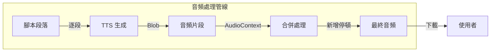

### 6.6 音頻合併實作 ✅ 已實現

```typescript
class AudioMerger {
  private audioContext: AudioContext;

  constructor() {
    this.audioContext = new AudioContext();
  }

  async mergeAudioBuffers(
    buffers: AudioBuffer[],
    pauseDuration: number = 0.3
  ): Promise<Blob> {
    // 計算總長度
    const sampleRate = this.audioContext.sampleRate;
    const pauseSamples = pauseDuration * sampleRate;
    const totalLength = buffers.reduce(
      (sum, buf) => sum + buf.length + pauseSamples,
      0
    );

    // 創建輸出緩衝區
    const output = this.audioContext.createBuffer(
      1, // 單聲道
      totalLength,
      sampleRate
    );

    // 合併音頻
    let offset = 0;
    for (const buffer of buffers) {
      output.copyToChannel(buffer.getChannelData(0), 0, offset);
      offset += buffer.length + pauseSamples;
    }

    // 轉換為 Blob
    return this.audioBufferToBlob(output);
  }

  private audioBufferToBlob(buffer: AudioBuffer): Blob {
    // 實作 AudioBuffer 轉 MP3/WAV
    // 使用 lamejs 或類似庫進行 MP3 編碼
  }
}
```

---

## 7. 實作路線圖

### 7.1 階段一：基礎架構 ✅ 已完成

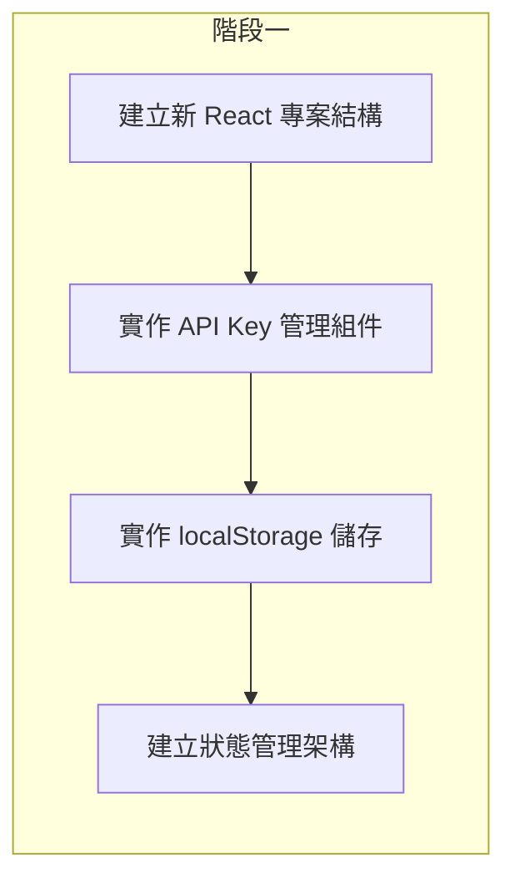

**任務清單：**
- [x] 建立新的前端專案結構
- [x] 實作 ApiKeyProvider Context
- [x] 建立 ApiKeyModal 彈出面板組件
- [x] 實作 localStorage API Key 儲存與讀取
- [x] 建立 useReducer 狀態管理

### 7.2 階段二：API 整合 ✅ 已完成

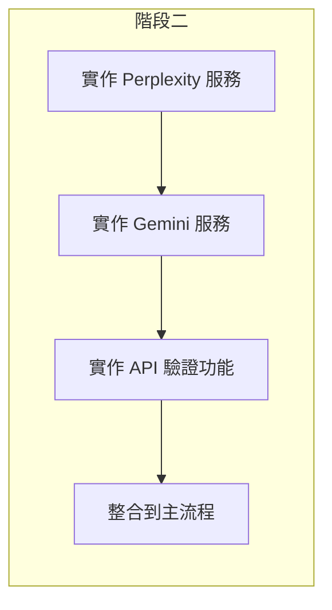

**任務清單：**
- [x] 建立 PerplexityService 類別
- [x] 實作 generateQuestions 方法
- [x] 實作 deepResearch 方法
- [x] 建立 GeminiService 類別
- [x] 實作 generateDialogueScript 方法
- [x] 建立 API Key 驗證功能

### 7.3 階段三：音頻生成 ✅ 已完成

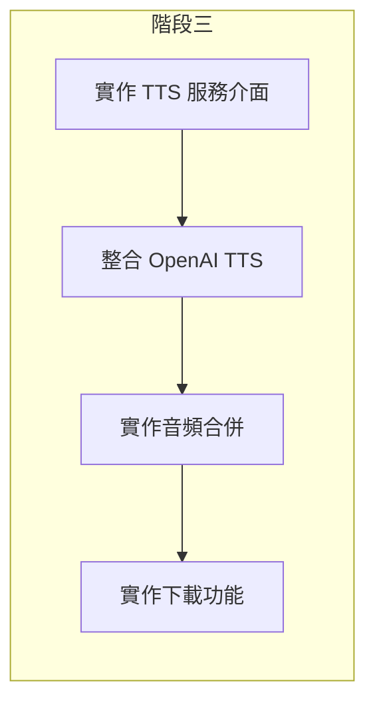

**任務清單：**
- [x] 建立 TTSService 介面
- [x] 實作 OpenAI TTS 整合
- [x] 建立 AudioMerger 類別
- [x] 實作音頻下載功能
- [x] 建立 AudioPlayer 組件

### 7.4 階段四：UI/UX 優化 ✅ 已完成

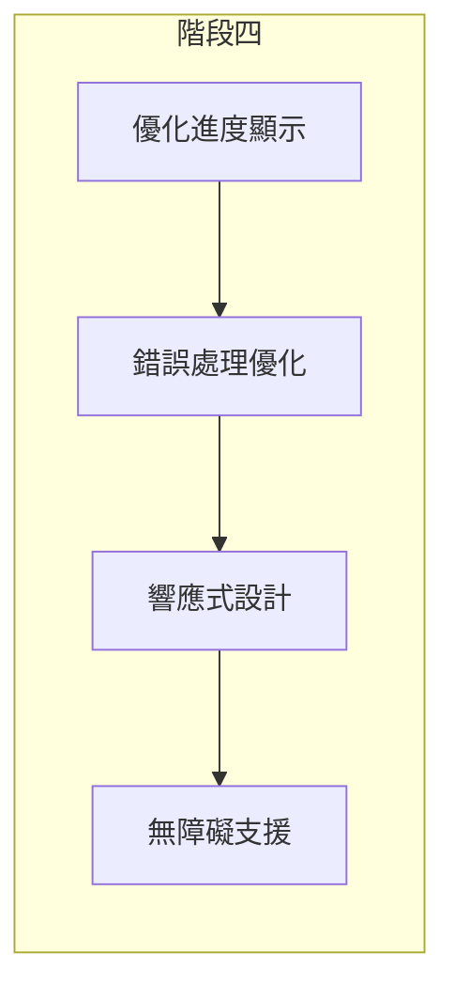

**任務清單：**
- [x] 建立進度動畫效果
- [x] 實作完整的錯誤處理
- [x] 優化行動裝置體驗
- [x] 加入 ARIA 標籤

### 7.5 階段五：部署與測試 ✅ 已完成

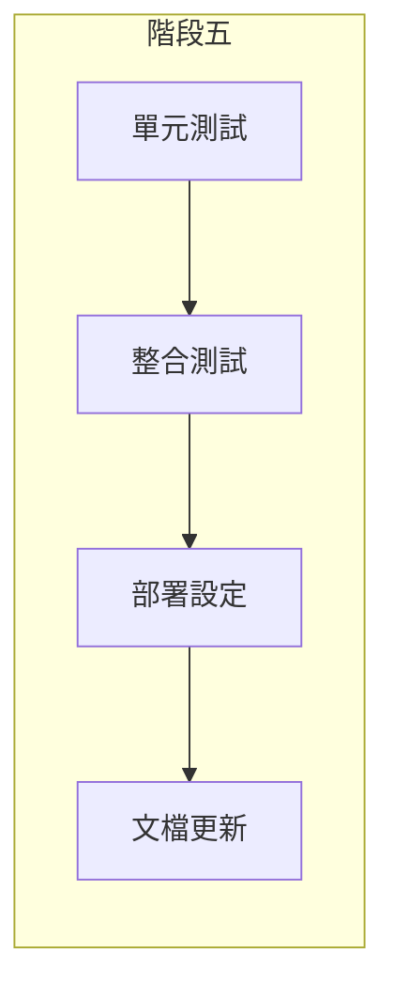

**任務清單：**
- [x] 撰寫服務層單元測試
- [x] 撰寫組件整合測試
- [x] 設定 Vercel/Netlify 部署
- [x] 更新 README 文檔

---

## 附錄

### A. 技術棧總結

| 層級 | 技術 |
|------|------|
| **前端框架** | React 18 + TypeScript |
| **狀態管理** | React Context + useReducer |
| **樣式** | Tailwind CSS |
| **構建工具** | Vite |
| **API 通訊** | Fetch API |
| **音頻處理** | Web Audio API + lamejs |
| **儲存** | localStorage |

### B. API 端點總覽

| API | 端點 | 用途 |
|-----|------|------|
| Perplexity | `https://api.perplexity.ai/chat/completions` | 研究、大綱生成 |
| Gemini | `https://generativelanguage.googleapis.com/v1beta/models/gemini-1.5-flash:generateContent` | 對話生成 |
| OpenAI TTS | `https://api.openai.com/v1/audio/speech` | 音頻生成 |

### C. 檔案結構建議

```
frontend/
├── src/
│   ├── components/
│   │   ├── Header/
│   │   │   ├── Header.tsx
│   │   │   └── index.ts
│   │   ├── ApiKeyPanel/
│   │   │   ├── ApiKeyPanel.tsx
│   │   │   ├── ApiKeyPanel.css
│   │   │   └── index.ts
│   │   ├── ResearchPanel/
│   │   │   ├── ResearchPanel.tsx
│   │   │   └── index.ts
│   │   ├── OutlinePanel/
│   │   │   ├── OutlinePanel.tsx
│   │   │   └── index.ts
│   │   ├── ScriptPanel/
│   │   │   ├── ScriptPanel.tsx
│   │   │   └── index.ts
│   │   ├── AudioPanel/
│   │   │   ├── AudioPanel.tsx
│   │   │   └── index.ts
│   │   │
│   │   ├── common/
│   │   │   ├── Button/
│   │   │   ├── Input/
│   │   │   └── ProgressBar/
│   │   │
│   ├── services/
│   │   ├── PerplexityService.ts
│   │   ├── GeminiService.ts
│   │   ├── TTSService.ts
│   │   ├── AudioService.ts
│   │   └── StorageService.ts
│   │
│   ├── contexts/
│   │   └── AppContext.tsx
│   │
│   ├── hooks/
│   │   ├── useApiKeys.ts
│   │   └── usePodcastGeneration.ts
│   │
│   ├── types/
│   │   └── index.ts
│   │
│   ├── utils/
│   │   └── helpers.ts
│   │
│   ├── App.tsx
│   └── main.tsx
│
├── package.json
├── vite.config.ts
└── tailwind.config.js
```

### D. 瀏覽器支援

| 瀏覽器 | 最低版本 |
|--------|----------|
| Chrome | 90+ |
| Firefox | 90+ |
| Safari | 15+ |
| Edge | 90+ |

---

*文檔版本：2.0*
*最後更新：2026-02-14*
